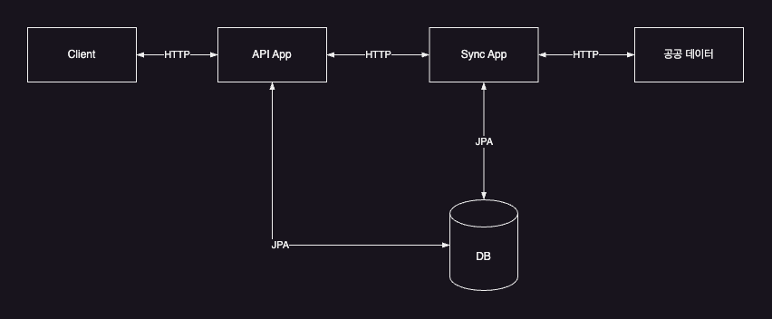
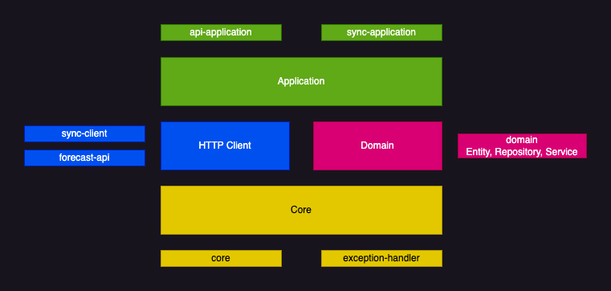

개요
====================
Kotlin + Spring Boot 를 이용하여 MSA 구조의 서비스를 구현하는 프로젝트

공공 데이터를 이용하여 위치 기반으로 지역의 단기예보를 조회, 저장하는 API 를 제공

구조
====================

- Client
  - 데이터 동기화, 조회를 요청하는 사용자로 HTTP 요청으로 대체 
- API App
  - Spring Boot App 으로 Client 로부터 api 요청을 받아 처리
  - POST /sync/village 요청 시 restTemplate + HTTP Interface 를 이용하여 Sync App 으로 전달
  - GET /forecast/village 요청 시 JPA 를 이용하여 DB 에 저장된 데이터를 조회하여 반환
- Sync App
  - Spring Boot App 으로 API App 으로 부터 요청을 받아 공공 데이터 포털의 단기 예보 정보를 저장하기 위한 `ForecastSyncEvent` 를 발행
  - `ForecastSyncEvent` 는 이벤트 핸들러에 의해 비동기로 처리되며, 외부 API 를 호출하여 데이터를 저장
- 공공 데이터
  - restTemplate + HTTP Interface 를 이용하여 구현  
- DB
  - MySQL 사용
  - 위치 정보를 기반으로 저장하기 때문에 Point 타입을 사용했으나, `Spatial Index` 설정은 하지 않음

프로젝트 구조
====================


- api-application
  - API App (localhost:8080)
- sync-application
  - Sync App (localhost:8090)
- sync-client
  - sync application 의 API(POST /sync/village) 를 호출하는 모듈
- external-api
  - 공공 데이터 포털의 단기 예보 정보를 조회하는 모듈 
- core
  - dto, exception, util 등을 정의한 모듈 
- domain
  - 도메인 모델(entity), 저장소(repository), 도메인 로직(service) 를 정의 
- exception-handler
  - api, sync application 에서 발생하는 예외를 처리하는 모듈 

API
====================
```HTTP
POST localhost:8080/sync/village

Content-Type: application/json
{
  "lat":37.7437027777777,
  "lng":127.049844444444
}

200 OK // 동기화 요청이 성공적으로 처리되었을 때
202 Accepted // 동기화 요청이 등록되었을 때
```

```HTTP
GET localhost:8080/forecast/village?lat=37.7437027777777&lng=127.049844444444

204 No Content // 해당 위치의 저장된 단기예보 정보가 없을 때
200 OK // 해당 위치의 단기예보 정보가 있을 때
[
    {
        "category": "TMP",
        "forecastDate": "2024-04-17",
        "forecastTime": "15:00:00",
        "forecastValue": "22",
        "baseDate": "2024-04-17",
        "baseTime": "14:00:00"
    } ...
]
```

Reference
====================
https://junuuu.tistory.com/627

https://github.com/Junuu/spring-study

https://unluckyjung.github.io/jpa/2023/04/20/JPA-OneToMany-one-way-relation-issue/

https://techblog.woowahan.com/2637/